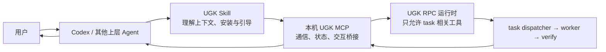
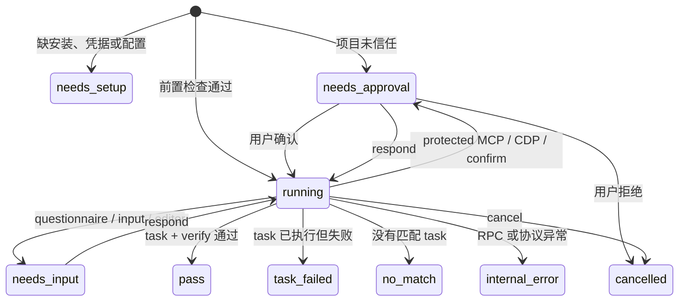

# UGK MCP Task Gateway 设计

状态：已确认，准备实施
日期：2026-07-15

## 一句话结论

UGK 不再和 Codex、Claude Code 争夺“主对话 Agent”的位置，而是成为它们可以调用的本机“已验收任务执行器”。

用户仍然和 Codex 对话；Codex 负责理解上下文，UGK 只负责找到合适的 task、执行它、运行 verify，并把结构化结果交还给 Codex。

## 1. 为什么值得做

用户已经有更好用的通用 Agent，没有理由为了普通对话再打开一套 UGK 界面。UGK 真正独特的资产是 task：

- task 把重复工作固化成可复用流程；
- verify 把“看起来完成”变成机器可检查的 PASS/FAIL；
- dispatcher、worker、verify 的边界让失败位置更容易诊断；
- 同类工作重复执行时，可以逐步积累稳定性，而不是每次从零提示通用 Agent。

因此产品定位不是“另一个 Agent”，而是：

> Codex 负责想清楚要做什么，UGK 负责把已经训练好的固定任务可靠地做完。

需要保留一个对抗式结论：**UGK 不会天然更好，也不会天然更省 token。** verify 只能证明它检查过的断言，额外的 dispatcher 和 worker 也会消耗 token。这个方向是否成立，最终要用同一请求重复执行的通过率、人工返工次数和总 token 来证明，不能只靠直觉。

## 2. 第一性原则约束

### 2.1 通过 MCP 使用 UGK，就必须使用 task

如果请求没有匹配到现有 task，UGK 返回 `no_match`，不能退化为一个拥有普通工具的通用 Agent。

原因很简单：如果 UGK 最后还是临时读文件、写代码、搜网页，那么用户直接让上层 Codex 做即可，多套一层只会增加延迟和 token。

### 2.2 一个 UGK MCP server，只暴露一个入口工具

不能为每个 task 注册一个 MCP tool。task 数量会持续增长，工具清单会越来越大，并把 task 结构泄漏给每个上层 Agent。

第一版只暴露一个名为 `ugk` 的 MCP tool，通过 `action` 区分操作：

- `start`：提交一次自然语言任务；
- `status`：检查环境或查询一次运行；
- `respond`：回答 UGK 的问题或确认；
- `cancel`：取消运行。

task 的发现和选择仍由 UGK 内部完成，体验等价于用户在 UGK TUI 中用自然语言触发 task。

### 2.3 当前项目目录必须显式传入

用户说“用 UGK 处理一下这个项目”时，“这个项目”指的是 Codex 当前工作的项目，不是 MCP server 自己启动时所在的目录。

所以：

- Skill 每次调用都必须传绝对路径 `cwd`；
- MCP server 不依赖自身 `process.cwd()`，也不调用全局 `process.chdir()`；
- 每个 UGK RPC 子进程用 `spawn(..., { cwd })` 启动；
- UGK 使用现有 `findWorkspaceRoot()` 解析真正的项目根目录；
- 返回值始终回显最终采用的 `workspaceRoot`。

### 2.4 上层 Agent 传“完整任务”，不传“最后一句话”

用户的真实要求可能散落在前面的对话中，例如目标文件、日期范围、输出格式和不能做的事情。

Codex Skill 要把这些已有信息压缩成一段最小但自包含的 request，再交给 UGK。它不能：

- 只转发用户最后一句模糊的话；
- 把全部聊天记录无脑塞给 UGK；
- 补造用户没有说过的需求。

## 3. 三层结构



各层职责不能混淆：

| 层 | 负责 | 不负责 |
| --- | --- | --- |
| Skill | 识别用户明确的 UGK 意图、补全上下文、检查安装和配置、驱动 MCP 状态机 | 执行 task、自己判断 verify 通过 |
| MCP | 启动本机 UGK、保存一次运行的状态、转发问题/确认、返回结构化错误 | 自己完成用户任务、替代 task router |
| UGK task runtime | 选择现有 task、翻译输入、执行 worker、运行 verify | 没有 task 时退化为通用 Agent |

Skill 与 MCP 在逻辑上仍然独立。第一版只实现 Codex 的使用说明；以后支持 Claude Code 时，只增加宿主说明和安装适配，不改 MCP 协议和 task runtime。

## 4. 用户看到的完整流程

### 4.1 首次使用

1. 用户安装 UGK Skill。
2. 用户说：“用 UGK 帮我查询 X 最近一天的讨论。”
3. Skill 发现 UGK 未安装或 MCP 未注册，先说明要做什么，并引导或代为执行本机安装。
4. Skill 用只读诊断检查 UGK、模型凭据、当前项目信任和 MCP 状态。
5. 所有前置条件满足后，Skill 编译出自包含 request，并调用 `ugk.start`。

MCP 未连接以前，不能指望 MCP 自己诊断 MCP。bootstrap 必须走本地 CLI：

```text
ugk mcp doctor --json
```

MCP 已连接以后，Skill 改用：

```json
{"action":"status","cwd":"E:/path/to/project"}
```

Codex 自身有没有注册 `ugk` MCP，由 Codex 适配说明通过 `codex mcp list` 检查；这个宿主专属检查不放进 UGK 通用 doctor。

### 4.2 日常使用

1. Codex 取得当前项目绝对路径。
2. Codex 从当前对话整理自包含 request。
3. `start` 返回 `runId` 和当前状态。
4. Codex 用 `status` 查询，直到完成或需要用户参与。
5. 如果 UGK 提问或请求授权，Codex 用用户听得懂的语言展示，再用 `respond` 回传。
6. UGK 完成 task 和 verify 后，Codex结合结构化结果向用户说明结论和产物位置。

## 5. MCP 协议

### 5.1 `start`

请求：

```json
{
  "action": "start",
  "cwd": "E:/AII/example-project",
  "request": "使用 x-search 查询关键词 X 在最近 24 小时的讨论，输出摘要和来源链接"
}
```

立即返回，不长期占住 MCP tool call：

```json
{
  "runId": "ugk-1721012345678-ab12cd",
  "status": "running",
  "workspaceRoot": "E:/AII/example-project"
}
```

第一版同一 MCP server 同时只允许一个 active run。已有运行时再次 `start`，返回普通业务状态 `busy` 和现有 `runId`，不作为 MCP 传输错误。

### 5.2 `status`

不带 `runId` 时检查当前环境；带 `runId` 时查询运行：

```json
{"action":"status","runId":"ugk-1721012345678-ab12cd"}
```

返回中包含：

- 当前业务状态；
- `workspaceRoot`；
- task 名称（选定以后）；
- 当前阶段；
- 等待中的 interaction；
- 最近的有限条进展；
- 完成时的结果、产物和诊断。

`status` 是唯一可信状态源。MCP progress notification 可以以后增加，但不能成为正确性依赖。

### 5.3 `respond`

```json
{
  "action": "respond",
  "runId": "ugk-1721012345678-ab12cd",
  "interactionId": "ui-3",
  "value": "最近 24 小时"
}
```

确认型交互使用 `confirmed`，取消使用 `cancelled`。`interactionId` 必须匹配当前等待项，防止旧回答写进新问题。

### 5.4 `cancel`

```json
{"action":"cancel","runId":"ugk-1721012345678-ab12cd"}
```

MCP 先向 RPC 子进程发送 `abort`，短暂等待后再终止子进程。最终状态为 `cancelled`，已有日志和产物不删除。

## 6. 状态机

业务状态统一为：

- `running`
- `needs_input`
- `needs_approval`
- `needs_setup`
- `pass`
- `no_match`
- `task_failed`
- `cancelled`
- `internal_error`
- `busy`



`needs_setup` 不自动修改机器。Skill 在得到用户同意后完成安装或配置，再重新 `start`；这属于恢复前置条件，不占用“一次自动纠错重试”。

## 7. UGK 内部执行边界

MCP 为每个 run 启动现有 `ugk --mode rpc --no-session` 子进程，并设置专用 gateway 模式。

gateway 模式只启用三个工具：

- `run_task`
- `questionnaire`
- `task_gateway_result`

`task_gateway_result` 第一版只用于返回结构化 `no_match`。普通 PASS/FAIL 直接读取 `run_task` 的结构化 tool result。

gateway system prompt 的硬规则：

1. 只能从可用 taskbook 中选择；
2. 匹配时调用一次 `run_task`，可使用其 single 或 parallel 模式；
3. 不匹配时必须调用 `task_gateway_result({status:"no_match"})`；
4. 不能自己用普通工具完成请求；
5. 信息不足时可调用 `questionnaire`；
6. 不允许创建、编辑或修复 taskbook。

第一版一次 gateway request 只允许一次 `run_task` 调用。顺序依赖的多 task 编排留到有真实案例后再设计，避免一开始把运行状态和失败语义做复杂。

专用 task 在普通 TUI 中仍然按现有规则渐进披露；但用户已经明确要求“用 UGK”时，gateway 可以看到完整 task 清单，从而完成内部匹配。

## 8. 信任、授权和问题如何穿过两层 Agent

### 8.1 工作区信任

工作区信任发生在 UGK RPC 启动之前，所以 MCP 先复用现有：

- `findWorkspaceRoot()`
- `readTrustedWorkspaces()`
- `isWorkspaceTrusted()`
- `trustWorkspace()`

未信任时，`start` 创建 run 并返回 `needs_approval`。只有用户明确同意后，`respond` 才写入信任记录并启动 RPC。

不能在正式产品里设置 `UGK_SKIP_WORKSPACE_TRUST=1`。这个变量只保留给现有测试。

### 8.2 UGK 内部的 protected MCP/CDP 授权

现有 `run_task` 已经会通过 `ctx.ui.confirm` 请求受保护工具授权，并只把授权过的环境变量传给 worker 子进程。RPC adapter 只需要把这个 `confirm` 转换为 `needs_approval`，再将用户答案原样写回 `extension_ui_response`。

MCP gateway 不能替用户默认同意，也不能把 UGK 全局切到 autopilot。

### 8.3 questionnaire 和普通输入

现有 RPC 已支持：

- `select`
- `confirm`
- `input`
- `editor`

所以不需要重做问卷协议。MCP 只把这些请求标准化成 interaction，Skill 再把它们翻译成用户容易理解的对话。

## 9. 配置与 API key

第一版只做本机安装。

安全约束：

- Skill 不用 `cat`、`Get-Content` 等命令把 key 读进 Agent 上下文；
- key 不放在命令行参数中；
- Skill 不回显 key；
- 用户可以把 key 放在一个本机文本文件中；
- 经用户同意后，调用本地 `ugk auth import --provider deepseek --file <path>`；
- UGK 本地进程读取、验证并写入 `~/.pi/agent/auth.json`，只返回脱敏状态；
- 不删除用户的源文件，除非用户另行明确要求。

这不能阻止不在意的用户主动把 key 粘贴进聊天，但产品默认路径不应鼓励这样做。

## 10. 结构化错误

正常业务失败不能只返回一句“失败”，也不应伪装成 MCP 断线。

`task_failed` 至少包含：

```json
{
  "status": "task_failed",
  "runId": "ugk-...",
  "task": "x-search",
  "stage": "verify",
  "code": "VERIFY_FAILED",
  "retryable": false,
  "attempts": 4,
  "workerSummary": "...",
  "verifyFailures": [],
  "artifacts": [],
  "outputDir": "E:/.../.tasks/runs/.../output",
  "suggestedAction": "检查时间范围或修正 taskbook"
}
```

稳定错误码至少覆盖：

| code | stage | 含义 |
| --- | --- | --- |
| `WORKSPACE_NOT_FOUND` | preflight | `cwd` 不存在 |
| `WORKSPACE_UNTRUSTED` | preflight | 等待用户信任 |
| `MODEL_AUTH_MISSING` | preflight | 模型凭据未配置 |
| `TASK_NOT_FOUND` | routing | router 选择了不存在的 task |
| `INPUT_INVALID` | dispatcher | 自然语言无法翻译成 contract 输入 |
| `MISSING_ENV` | preflight | task 声明的环境变量缺失 |
| `MISSING_BINARY` | preflight | task 声明的本机命令缺失 |
| `PROTECTED_TOOL_DENIED` | approval | 用户拒绝受保护工具 |
| `WORKER_FAILED` | worker | worker 未完成 |
| `VERIFY_FAILED` | verify | 产物未通过机器验收 |
| `RPC_CRASHED` | runtime | UGK 子进程异常退出 |

只有无效 MCP 请求、server 崩溃或协议损坏使用 MCP `isError`。`no_match`、`task_failed`、`needs_setup` 都是可读取的正常工具结果。

## 11. 上层自动纠错规则

Codex 对同一个用户请求最多自动重试一次，而且必须修改了实质输入：

- `INPUT_INVALID`：可以根据已有上下文补全 request 后重试一次；
- `VERIFY_FAILED`：只有诊断明确表明改变输入能够解决时才重试；
- `WORKER_FAILED`、`RPC_CRASHED`：不盲目自动重试；
- 完全相同的 request 禁止重复提交；
- 用户完成安装、配 key、信任或授权后的恢复不计入纠错重试。

UGK task 内部已有 worker → verify → checker 重试。上层的这一次重试不能与内部重试混为一谈。

## 12. 生命周期与数据

第一版保持最小：

- 一个 MCP server 只有一个 active run；
- 运行状态保存在内存；
- MCP server 退出时取消并终止子进程；
- server 重启后不恢复 run；
- task 产物、verify 结果和现有日志继续保存在原目录；
- status 中的进展列表设置固定上限，防止长任务无限占内存和 token。

## 13. 第一版明确不做

- 云端 UGK；
- Claude Code 适配；
- 普通请求的自动劫持；
- 每个 task 一个 MCP tool；
- 没有 task 时让 UGK 通用 Agent 接管；
- 跨进程重启恢复；
- 多用户和多并发队列；
- 顺序依赖的多 task 工作流；
- 自动创建或修复 task；
- 自动放宽 Codex 或 UGK 的安全策略。

## 14. 成功标准

### 14.1 功能验收

必须完成一条真实链路：

> Codex 对话 → UGK Skill → 本机 MCP → UGK RPC → `x-search` task → verify → Codex 得到结构化结果。

同时覆盖：

1. UGK 未安装；
2. MCP 未注册；
3. API key 未配置；
4. 当前项目未信任；
5. task 发起 questionnaire；
6. task 请求 protected MCP/CDP 授权；
7. 无匹配 task；
8. dispatcher 输入失败；
9. verify 失败；
10. 用户取消。

### 14.2 产品假设验收

选择 3 个代表性 task，每个固定输入重复运行至少 20 次，对比“Codex 直接执行”和“Codex 调 UGK”：

- verify 首次通过率；
- 最终成功率；
- 人工介入次数；
- 平均总 token；
- P50/P95 完成时间；
- 错误能否定位到明确 stage/code。

只有数据证明通过率更高，且 token/时延代价可接受，才能声称 UGK 在重复任务上更可靠或更省。

## 15. 现有能力复用

本设计优先复用现有代码：

- `bin/ugk.js`：CLI 入口；
- `bin/workspace-trust.js`：项目根目录和信任记录；
- `scripts/smoke-rpc.mjs`：RPC JSONL 驱动和 UI response 示例；
- `extensions/questionnaire.ts`：问卷；
- `extensions/task/task.ts`：`run_task`、worker、verify 和重试；
- `extensions/task/task-registry.ts`：task 清单；
- `@modelcontextprotocol/sdk`：项目已经安装，直接实现 STDIO MCP server。

Codex 适配遵循当前官方能力：Skill 作为可复用工作流，本地 STDIO MCP 作为工具连接。未来如果需要一键分发，可以再用 Codex plugin 把 Skill 和 MCP 配置打包；这不是第一版运行时的必要条件。

官方参考：

- [Codex：Build skills](https://learn.chatgpt.com/docs/build-skills.md)
- [Codex：Model Context Protocol](https://learn.chatgpt.com/docs/extend/mcp.md)
- [Codex：Build plugins](https://learn.chatgpt.com/docs/build-plugins.md)
