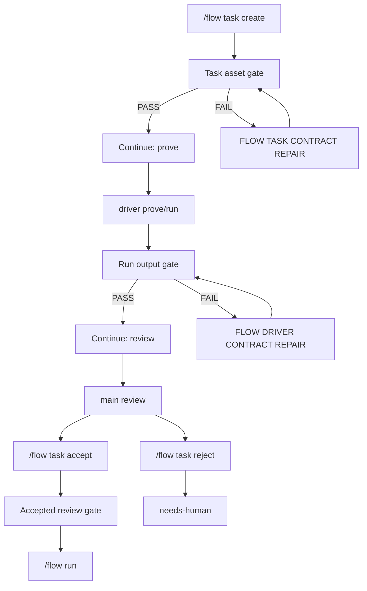

# Flow Runtime Gates Design And Implementation Notes

## 背景

Flow 的目标不是让用户理解内部文件规范，而是让用户完成业务判断。用户不应该知道或修复 `task.json`、`review.json`、`validation.json`、schema、`output/result.json` 这类内部契约。

因此 Flow 的基本原则是：

- 用户只判断业务结果和可复用偏好。
- agent 可以犯错，但错误必须撞到 runtime gate。
- 固定生命周期状态必须由 runtime 写入或复验。
- 内部契约失败不能升级成 `needs-human`，只能是 runtime contract failure 或自动修复流程。

## 当前生命周期



## 已实现的硬门禁

### 1. Task Asset Gate

位置：

- `extensions/flow/task-validation.ts`
- `extensions/flow/index.ts`

检查内容：

- `.flow/tasks/<task-id>/task.json`
- `.flow/tasks/<task-id>/SKILL.md`
- `.flow/tasks/<task-id>/todo.template.md`
- `.flow/tasks/<task-id>/validator.md`
- `.flow/tasks/<task-id>/input.schema.json`
- `.flow/tasks/<task-id>/output.schema.json`

JSON 结构检查：

- `task.json` 必须是 JSON object。
- `input.schema.json` 必须是 JSON object。
- `output.schema.json` 必须是 JSON object。

触发时机：

- `/flow task prove <task-id>` 启动前。
- `/flow task create` 后的 `agent_end` 检测。

失败处理：

- runtime 发 `[FLOW TASK CONTRACT REPAIR]` 给 main agent。
- 用户不需要知道缺什么文件。
- 修复后 runtime 复验。
- 复验仍失败则报 `Flow task contract failed after automatic repair`。

当前限制：

- 这是事后 gate，不是文件写入时拦截。
- agent 仍可能先写出脏资产，再由 runtime 修。
- 目前只做一次自动修复。

### 2. Prove/Run Start Gate

位置：

- `extensions/flow/index.ts`

`prove` 启动前：

- task id 必须合法。
- task 必须存在。
- Task Asset Gate 必须通过。

`run` 启动前：

- task id 必须合法。
- task 必须存在。
- task status 必须是 `verified` 或 `active`。
- 必须存在 `latest_review_run`。
- latest review 必须通过 Accepted Review Gate。

失败处理：

- runtime 阻止创建 driver run。
- 不创建新的 `runs/run-*`。

当前限制：

- `prove` 目前不强制 task status 必须是 `draft` 或 `needs-human`。
- `run` gate 可以阻止使用，但不能阻止 agent 手工改 `task.json`。

### 3. Run Output Gate

位置：

- `extensions/flow/run-validation.ts`
- `extensions/flow/index.ts`

检查内容：

- `runs/<run-id>/output/result.json` 必须存在且是合法 JSON。
- 如果 task 有 `output.schema.json`，`result.json` 必须满足当前轻量 schema 检查。
- `runs/<run-id>/evidence/` 必须包含至少一个非空文件。
- `runs/<run-id>/progress.md` 必须存在。

结果语义：

- 只有 `PASS` 或 `FAIL`。
- `missing output/result.json` 是 `FAIL`，不是 `NEEDS-HUMAN`。

失败处理：

- runtime 发 `[FLOW DRIVER CONTRACT REPAIR]` 给 driver。
- driver 修复后 runtime 再跑一次 `validateFlowRun(...)`。
- 复验通过才进入 review gate。
- 复验仍失败则报 `Flow driver contract failed after automatic repair`。

当前限制：

- runtime 只做结构和证据存在性检查。
- `report.md` 内容质量、搜索策略是否合理、业务解释是否清楚，仍需要 review 阶段判断。
- 目前只做一次自动修复。

### 4. Review Start Gate

位置：

- `extensions/flow/index.ts`

检查内容：

- run 必须存在。
- driver 不能仍在运行。
- `validation.json` 必须存在且 result 是 `PASS`。
- review 必须由 main agent 主持，不能由 driver 自评。

失败处理：

- runtime 阻止 review。
- validation missing/FAIL 时不会进入用户 review，也不会写 `review.json`。

当前限制：

- review 内容的质量仍主要靠 prompt 和后续 accept gate。
- runtime 目前不解析 `review.md` 内容是否完整。

### 5. Review Prompt User Boundary

位置：

- `extensions/flow/prompts.ts`

当前 prompt 明确要求：

- 用户只判断业务结果和可复用偏好。
- 只问用户能理解和能决定的问题，例如结果是否可接受、是否把这次成功步骤保存为以后复用的流程、输出口径是否要调整。
- 给用户看的问题里不得出现 `output/result.json`、schema、evidence、driver、Task skill、run、`review.json`、`validation.json`、`SKILL.md`、`validator.md`、`task.json` 等内部术语。
- 必须明确用户动作：回复“接受”表示结果满意并保存复用流程；回复“拒绝：原因”表示结果不满意；回复“调整：内容”表示先按用户要求修改口径或流程。
- `input.json`、schema、evidence 粒度、lifecycle 字段由 agent/runtime 自己修复和复验。
- 如果用户说不懂，agent 必须先解释问题和用户决策的关系，不能跳过或替用户沉默处理。

当前限制：

- 这是 prompt 约束，不是硬门禁。
- agent 仍可能问出内部问题。
- 后续需要把 review 输入改成 runtime UI 表单或结构化 review command，减少自由文本失控。

### 6. Accept Review Gate

位置：

- `extensions/flow/review-store.ts`
- `extensions/flow/index.ts`

`/flow task accept <run-id>` 要求：

- run validation 必须是 `PASS`。
- review 必须已经开始。
- runtime 调用 `acceptFlowReview(...)` 写入 canonical `review.json`。

canonical accepted review 包含：

- `status: "accepted"`
- `userConfirmed: true`
- `taskDesignDecision: "updated" | "no-change"`
- `taskVersion`
- `acceptedAt`
- `decisions`
- `updatedFiles`

accept 后 runtime 更新 task：

- `status: "verified"`
- `latest_review_run`
- `latest_review_status`
- `latest_validation`
- `next_step: /flow run <task-id>`

当前限制：

- agent 仍可能手工写 `review.json` 或 `task.json`。
- runtime 在 `/flow run` 前会发现并处理部分可修复的不合法 accepted review。

### 7. Accepted Review Gate Before Run

位置：

- `extensions/flow/index.ts`
- `extensions/flow/review-store.ts`

检查内容：

- review 的 `taskId` 必须匹配当前 task。
- review 的 `runId` 必须匹配 `latest_review_run`。
- review status 必须是 `accepted`。
- `userConfirmed` 必须为 true。
- task design 必须已落定：`taskDesignUpdated` true，或 `taskDesignDecision` 是 `updated/no-change`。
- `taskVersion` 必须存在且 `>= task.version`。

自动规范化：

- 如果 review 是 `accepted` 且 `userConfirmed` true，身份匹配当前 task/run，并且缺少 `taskVersion`，runtime 会调用 `acceptFlowReview(...)` 按当前 task version 重写成 canonical accepted review。
- 如果 review 已经有 `taskVersion` 但小于当前 task version，runtime 不会自动抬版本；必须重新 review/accept。
- 如果 review 的 `taskId` 或 `runId` 不匹配，runtime 不会自动修复。
- 重写后仍不合法则阻止 `/flow run`。

当前限制：

- 只能修复可推断的 accepted review。
- 如果 review 缺少用户确认或状态不是 accepted，runtime 不会猜。

### 8. Reject Review Gate

位置：

- `extensions/flow/review-store.ts`
- `extensions/flow/index.ts`

`/flow task reject <run-id>` 会：

- 要求 review 已经开始。
- 要求 run validation 是 `PASS`。
- 写 `review.json` 为 `needs-changes`。
- 更新 task status 为 `needs-human`。
- 记录 rejection reason。

失败处理：

- review 未开始时阻止 reject，不写 `needs-human`。
- validation missing/FAIL 时阻止 reject，不写 `needs-human`。

语义：

- `needs-human` 只表示业务 review 拒绝或需要用户决策。
- 内部契约失败不能写成 `needs-human`。

## Agent 是否会遵守

不会稳定遵守。当前设计不再依赖 agent 自觉遵守关键生命周期规则，而是尽量让 agent 错误撞到 runtime gate。

当前可靠性分层：

| 类别 | 可靠性 | 当前机制 |
| --- | --- | --- |
| Task 资产存在和 JSON 结构 | 高 | runtime gate + repair prompt |
| Run 输出结构 | 高 | runtime validation + driver repair |
| Accepted review canonical 字段和身份 | 高 | accept command + run 前修复 gate |
| run 是否允许启动 | 高 | runtime start gate |
| 用户是否被问内部问题 | 中 | prompt + tests，不是硬门禁 |
| SKILL/validator 是否正确沉淀用户决策 | 中低 | review prompt，缺少结构化 diff gate |
| lifecycle 文件是否完全禁止 agent 手写 | 低 | 目前没有统一 writer gate |

## 已知缺口

### 缺口 1：没有 runtime-only writer

目前 agent 仍可能直接修改：

- `task.json`
- `review.json`
- `status.json`
- `validation.json`
- `validation.md`

虽然运行前会检查一部分状态，但没有从写入入口阻止脏数据落盘。

建议后续实现：

- 将 lifecycle 文件定义为 runtime-owned。
- agent 只能写业务草稿和 review notes。
- runtime API 负责写 `task.json/status.json/validation.json/review.json`。
- 所有写入先过 schema/semantic validation。

### 缺口 2：review 仍是自由文本流程

review prompt 已限制用户边界，但 agent 仍可能问错。

建议后续实现：

- runtime 提供结构化 review UI：
  - 结果是否可接受。
  - 是否固化操作路径。
  - 是否调整输出口径。
  - 是否需要重新 prove。
- agent 只负责解释和记录，不直接决定 lifecycle。

### 缺口 3：Task 资产语义质量未硬校验

当前 Task Asset Gate 只检查文件存在和 JSON object。

建议后续实现：

- `task.json` schema 校验必需字段。
- `input.schema.json/output.schema.json` 必须至少包含 `type: "object"`。
- `SKILL.md`、`validator.md` 必须包含最小章节。
- `todo.template.md` 必须包含证据、偏离、复盘候选字段。

### 缺口 4：自动修复次数固定为一次

当前 Task asset repair 和 driver output repair 都只自动尝试一次。

建议后续实现：

- 记录 repair attempts。
- 对可机械修复问题允许多次。
- 对语义问题停止并报告系统 contract failure。

## 实现文件索引

- `extensions/flow/index.ts`：Flow orchestration、stage gate、driver start/run/review/accept/reject。
- `extensions/flow/task-validation.ts`：Task asset gate。
- `extensions/flow/run-validation.ts`：Run output gate。
- `extensions/flow/review-store.ts`：review canonical write/read/accepted predicate。
- `extensions/flow/prompts.ts`：agent prompt 和内部 repair prompt。
- `extensions/flow/flow-console.ts`：菜单和固定下一步。
- `extensions/flow/status-presenter.ts`：Flow Activity 展示。

## 测试覆盖

关键测试：

- `tests/flow-extension.test.ts`
  - create 后缺 Task 资产时发 repair prompt，不显示 prove gate。
  - 手动 prove 缺 Task 资产时发 repair prompt，不创建 run。
  - driver 缺 `output/result.json` 时发 driver repair prompt。
  - driver repair 成功后才进入 review。
  - driver repair 失败不会排用户 validation handoff。
  - PASS + Stop here 不再隐藏排 handoff。
  - 半合法 accepted review 在 `/flow run` 前 canonicalize。
  - 过期 accepted review 不会被自动抬到当前 task version。
  - task/run 身份不匹配的 accepted review 不能放行 `/flow run`。
  - validation missing/FAIL 不能启动 review。
  - review 未开始或 validation missing/FAIL 不能 reject 成 `needs-human`。
- `tests/flow-run-validation.test.ts`
  - 缺 `output/result.json` 是 `FAIL`。
  - schema/evidence/progress 检查。
- `tests/flow-review-store.test.ts`
  - accepted review predicate 校验 `taskVersion` 等字段。
- `tests/flow-prompts.test.ts`
  - review prompt 不要求用户理解内部契约。

## 当前验证命令

```powershell
npm test
git diff --check
```

最近验证结果：

- `npm test`: 252 pass / 0 fail
- `git diff --check`: pass
